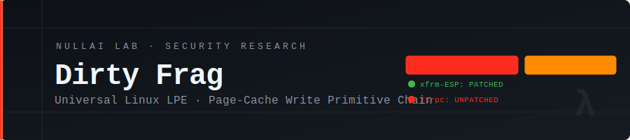
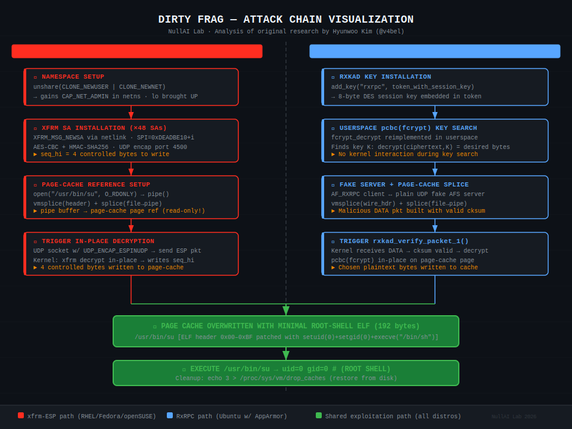

# Dirty Frag — Deep Technical Analysis

<p align="center">
  
</p>

<br>

<p align="center">
  
  &nbsp;
  
  &nbsp;
  
  &nbsp;
  
</p>

<br>

> [!WARNING]
> **Responsible Disclosure Notice**
> This repository contains **educational analysis only**. The original vulnerability was discovered and responsibly disclosed by **Hyunwoo Kim ([@v4bel](https://x.com/v4bel))**. All technical credit belongs to the original researcher. This work is a deep-dive analysis produced by **NullAI Lab** for educational and defensive purposes only.

<br>

## Table of Contents

- [Overview](#overview)
- [Bug Class Lineage](#bug-class-lineage)
- [Vulnerability Chain](#vulnerability-chain)
  - [CVE-2026-43284 — xfrm-ESP Page-Cache Write](#cve-2026-43284--xfrm-esp-page-cache-write)
  - [CVE-2026-43500 — RxRPC Page-Cache Write](#cve-2026-43500--rxrpc-page-cache-write)
- [Why Chaining?](#why-chaining)
- [Attack Flow](#attack-flow)
- [Affected Versions](#affected-versions)
- [Mitigation and Hardening](#mitigation-and-hardening)
- [Detection Guidance](#detection-guidance)
- [Disclosure Timeline](#disclosure-timeline)
- [References](#references)

<br>

## Overview

**Dirty Frag** is a **universal Linux Local Privilege Escalation (LPE)** vulnerability class that achieves root access on all major Linux distributions by chaining two independent **Page-Cache Write** primitives.

| Component | Bug | CVE | Status |
|---|---|---|---|
| `net/xfrm` (ESP over UDP) | Arbitrary 4-byte write to page cache via `seq_hi` | CVE-2026-43284 | ✅ **Patched** — mainline [f4c50a4034e6](https://git.kernel.org/pub/scm/linux/kernel/git/torvalds/linux.git/commit/?id=f4c50a4034e62ab75f1d5cdd191dd5f9c77fdff4) |
| `net/rxrpc` + `rxkad` | Arbitrary write via authenticated RxRPC data packets | CVE-2026-43500 | ❌ **Unpatched** — no fix in any tree |

The exploit is **deterministic** (no race condition), does **not** panic the kernel on failure, and achieves a **very high success rate** across tested distributions.

<br>

## Bug Class Lineage

Dirty Frag belongs to a well-defined kernel bug family centered around **page cache contamination**:

```
Dirty Pipe (2022)          Copy Fail (2024)          Dirty Frag (2026)
      │                          │                          │
      └──── splice() + pipe ─────┴──── page-cache STORE ───┘
            page-cache write              primitive
```

All three share the same **sink**: a writable reference to a read-only page cache page. What Dirty Frag adds is **two independent sources** that together cover each other's blind spots across all mainstream distributions.

> For a detailed breakdown, see [bug-class.md](bug-class.md)

<br>

## Vulnerability Chain

### CVE-2026-43284 — xfrm-ESP Page-Cache Write

**Location:** `net/xfrm/xfrm_input.c` and ESP decryption path  
**Introduced:** commit `cac2661c53f3` (2017-01-17)  
**Patched:** commit `f4c50a4034e6` (mainline, 2026-05-08)

#### Root Cause

When an **ESP-in-UDP** packet is received, the kernel decrypts the payload **in-place** using the page-cache page that was spliced into the pipe. The `seq_hi` field of an ESN replay state structure is written into the decrypted payload **before** verifying that the underlying page is not a shared read-only mapping.

The result: an attacker with ability to create a user namespace can craft XFRM Security Associations with arbitrary `seq_hi` values, and by chaining `splice()` + `vmsplice()`, land those bytes on any offset of any file in the page cache — **including SUID binaries**.

**Primitive:** Arbitrary 4-byte STORE to page-cache page  
**Privilege required:** Unprivileged user namespace creation (`CLONE_NEWUSER | CLONE_NEWNET`)

<br>

### CVE-2026-43500 — RxRPC Page-Cache Write

**Location:** `net/rxrpc/`, `net/rxrpc/rxkad.c`  
**Introduced:** commit `2dc334f1a63a` (2023-06)  
**Patched:** ❌ Not patched in any tree as of 2026-05-08

#### Root Cause

The `rxkad` security layer in AF_RXRPC performs **in-place decryption** of incoming data packets using `pcbc(fcrypt)`. When a malicious "server" sends a crafted DATA packet with a valid-looking `cksum` (computed from an attacker-controlled session key), the kernel decrypts the packet payload directly into the page-cache page that was previously spliced into the socket's receive pipe.

Because `rxrpc.ko` is loaded by default on **Ubuntu**, this path provides an alternative source for the same primitive where the xfrm path may be blocked by AppArmor.

**Primitive:** Arbitrary write via chosen-plaintext + userspace key search  
**Privilege required:** None — no namespace creation needed

<br>

## Why Chaining?

Neither primitive alone is universal:

| Path | Works On | Blind Spot |
|---|---|---|
| **xfrm-ESP** | RHEL, Fedora, openSUSE, CentOS | Blocked on Ubuntu (AppArmor denies `CLONE_NEWUSER`) |
| **RxRPC** | Ubuntu (default) | `rxrpc.ko` not shipped on RHEL/Fedora/openSUSE |

**Together**, they cover every major distribution:

```
Ubuntu (AppArmor blocks CLONE_NEWUSER)  ──►  Use RxRPC path   (rxrpc.ko default)
RHEL / Fedora / openSUSE / CentOS      ──►  Use xfrm-ESP path (namespaces open)
```

This is the key architectural insight of Dirty Frag: **chaining coverage, not complexity**.

<br>

## Attack Flow

<p align="center">
  
</p>

```
1. SETUP     Identify viable path: xfrm or rxrpc
2. SPLICE    vmsplice() + splice() → page-cache ref into pipe → SUID binary
3. WRITE     Trigger in-place decryption → overwrite ELF header (192 bytes)
4. VERIFY    Read back target bytes to confirm write succeeded
5. EXECUTE   Run patched SUID binary → setuid(0) + execve(/bin/sh) → ROOT
6. CLEANUP   echo 3 > /proc/sys/vm/drop_caches  (or reboot)
```

> For the full step-by-step breakdown, see [attack-flow.md](attack-flow.md)

<br>

## Affected Versions

### xfrm-ESP (CVE-2026-43284)

| Distribution | Kernel Version | Status |
|---|---|---|
| Ubuntu 24.04.4 | 6.17.0-23-generic | ⚠️ Affected |
| RHEL 10.1 | 6.12.0-124.49.1.el10_1.x86_64 | ⚠️ Affected |
| openSUSE Tumbleweed | 7.0.2-1-default | ⚠️ Affected |
| CentOS Stream 10 | 6.12.0-224.el10.x86_64 | ⚠️ Affected |
| AlmaLinux 10 | 6.12.0-124.52.3.el10_1.x86_64 | ⚠️ Affected |
| Fedora 44 | 6.19.14-300.fc44.x86_64 | ⚠️ Affected |

**Scope:** Kernels from `cac2661c53f3` (Jan 2017) → mainline (May 2026) — ~9 years.

### RxRPC (CVE-2026-43500)

**Scope:** Kernels from `2dc334f1a63a` (Jun 2023) → present. **No patch exists.**

<br>

## Mitigation and Hardening

> [!CAUTION]
> No distribution patch exists for CVE-2026-43500. Apply the following workaround immediately.

### Immediate Workaround — Block Vulnerable Modules

```bash
sudo sh -c "printf 'install esp4 /bin/false\ninstall esp6 /bin/false\ninstall rxrpc /bin/false\n' \
  > /etc/modprobe.d/dirtyfrag.conf; \
  rmmod esp4 esp6 rxrpc 2>/dev/null; \
  echo 3 > /proc/sys/vm/drop_caches; \
  true"
```

**What this does:**
- Permanently blacklists `esp4`, `esp6`, and `rxrpc` kernel modules
- Unloads currently running modules (errors are non-fatal)
- Flushes page cache to remove any existing contamination

### Ubuntu — Additional Namespace Restriction

```bash
echo 'kernel.unprivileged_userns_clone=0' | sudo tee /etc/sysctl.d/99-ns-restrict.conf
sudo sysctl --system
```

### RHEL / Fedora / CentOS — User Namespace Limit

```bash
echo 'user.max_user_namespaces=0' | sudo tee /etc/sysctl.d/99-userns.conf
sudo sysctl --system
```

> For full hardening including auditd rules and YARA signatures, see [hardening-guide.md](hardening-guide.md)

<br>

## Detection Guidance

| Indicator | Notes |
|---|---|
| Unusual XFRM SA creation by unprivileged process | `ip xfrm state` shows SAs with `spi 0xDEADBExx` patterns |
| `rxrpc` socket creation by non-system process | Rare outside AFS/Kerberos environments |
| `vmsplice` + `splice` calls targeting SUID binary fds | auditd: `-S splice -S vmsplice` |
| Hash mismatch on `/usr/bin/su` | `sha256sum /usr/bin/su` vs package DB |
| Writes to `/proc/sys/vm/drop_caches` | May indicate post-exploitation cleanup |

<br>

## Disclosure Timeline

| Date | Event |
|---|---|
| 2017-01-17 | `cac2661c53f3` introduces xfrm-ESP page-cache write primitive |
| 2023-06 | `2dc334f1a63a` introduces RxRPC write primitive |
| 2026 (early) | Hyunwoo Kim (@v4bel) discovers and chains the two primitives |
| 2026 | Reported to `linux-distros@vs.openwall.org`; embargo begins |
| 2026-05-08 | Embargo broken; public disclosure at maintainers' request |
| 2026-05-08 | CVE-2026-43284 assigned; mainline patch `f4c50a4034e6` merged |
| 2026-05-08 | CVE-2026-43500 reserved; **no patch in any tree** |

<br>

## References

| Resource | Link |
|---|---|
| Original Research (V4bel) | https://github.com/V4bel/dirtyfrag |
| CVE-2026-43284 Patch | https://git.kernel.org/pub/scm/linux/kernel/git/torvalds/linux.git/commit/?id=f4c50a4034e62ab75f1d5cdd191dd5f9c77fdff4 |
| Dirty Pipe (2022) | https://dirtypipe.cm4all.com/ |
| Copy Fail (2024) | https://copy.fail/ |
| linux-distros | linux-distros@vs.openwall.org |

<br>

## About NullAI Lab

**NullAI Lab** is an independent security research group focused on deep kernel vulnerability analysis, defensive tooling, and responsible disclosure education.

> *"Understanding how things break is the first step to building things that don't."*

<br>

<p align="center">
  <sub>Analysis by NullAI Lab &nbsp;·&nbsp; Original discovery by Hyunwoo Kim (@v4bel) &nbsp;·&nbsp; For educational purposes only</sub>
</p>